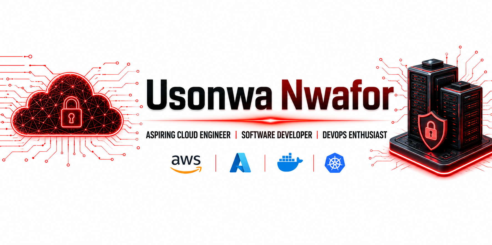

<!-- ========================= HEADER ========================= -->

  

  

  

---

## 👋 About Me

I'm an aspiring **Cloud & DevOps Engineer** with a passion for technology, automation, and building reliable systems.

I enjoy learning new technologies, building real-world projects, and continuously improving my skills in **Cloud Computing, Software Development, Linux, and DevOps**.

* 🔭 Currently working on **Cloud & DevOps Projects**
* 🌱 Currently learning **AWS, Azure, Docker, Kubernetes, and CI/CD**
* 🤝 Open to collaborating on **Open Source and Cloud Projects**
* 💬 Ask me about **Python, Linux, Cloud, DevOps, and Software Development**
* 🎯 My goal is to become a **Cloud & DevOps Engineer**
* ⚡ Fun fact: I enjoy learning by building practical projects

---

## 🌐 Connect With Me

  &nbsp;&nbsp;&nbsp;
  

---

## 💻 Technologies & Tools

  

  
  
  

---

## 🚀 Featured Projects

### ☁️ Cloud Infrastructure Projects

Projects focused on deploying and managing cloud infrastructure using modern cloud technologies and automation tools.

🔗 **Repository:** Coming soon

---

### 🐳 Docker & Containerization

Hands-on projects exploring containerization, Docker, and application deployment.

🔗 **Repository:** Coming soon

---

### ⚙️ DevOps & CI/CD

Projects focused on automation, CI/CD pipelines, version control, and improving software delivery.

🔗 **Repository:** Coming soon

---

## 🏆 Certifications & Achievements

| Certification                                | Issuing Organization | Credential                                                                                                                                                                                                                                                                                                                                                                                                                                                                                                                                                                                                                                                                                                                                                                                                                                                                                                            |
| -------------------------------------------- | -------------------- | --------------------------------------------------------------------------------------------------------------------------------------------------------------------------------------------------------------------------------------------------------------------------------------------------------------------------------------------------------------------------------------------------------------------------------------------------------------------------------------------------------------------------------------------------------------------------------------------------------------------------------------------------------------------------------------------------------------------------------------------------------------------------------------------------------------------------------------------------------------------------------------------------------------------- |
## 🏆 Certifications & Achievements

| # | Certification | Issuing Organization | Credential |
|---|---|---|---|
| 1 | **FinOps Certified Practitioner** | FinOps Foundation | [View Credential](https://www.credly.com/badges/c83fae84-6727-40ce-b3ed-31d2120e4414/linked_in_profile) |
| 2 | **Microsoft Applied Skills: Configure secure access to your workloads using Azure networking** | Microsoft | [View Credential](https://learn.microsoft.com/api/credentials/share/en-gb/IfeomaNwafor-8949/90282CBB64019DEB?sharingId) |
| 3 | **Microsoft Applied Skills: Get started with identities and access using Microsoft Entra** | Microsoft | [View Credential](https://learn.microsoft.com/api/credentials/share/en-us/IfeomaUsonwaNwafor-9604/D3CB3AE5C2A9D78F?sharingId) |
| 4 | **Microsoft Applied Skills: Get started with cloud security and monitoring tasks** | Microsoft | [View Credential](https://learn.microsoft.com/api/credentials/share/en-us/IfeomaUsonwaNwafor-9604/245C128235D7FE60?sharingId) |
| 5 | **Microsoft Applied Skills: Deploy and configure Azure Monitor** | Microsoft | [View Credential](https://learn.microsoft.com/api/credentials/share/en-us/IfeomaUsonwaNwafor-9604/1192B72C75042049?sharingId=BACD1689C838AF99) |
| 6 | **Microsoft Applied Skills: Get started with Azure management tasks** | Microsoft | [View Credential](https://learn.microsoft.com/api/credentials/share/en-us/IfeomaUsonwaNwafor-9604/5FA7E11983A2E148?sharingId) |
| 7 | **Microsoft Applied Skills: Secure storage for Azure Files and Azure Blob Storage** | Microsoft | [View Credential](https://learn.microsoft.com/api/credentials/share/en-us/IfeomaUsonwaNwafor-9604/4432DEB95B6E307E?sharingId) |
| 8 | **Multicloud Network Associate** | Multicloud Network Associate | [View Credential](https://www.credly.com/badges/3495a747-a532-4723-9f30-66a45be47598/linked_in_profile) |
| 9 | **ISO/IEC 27001:2022 Lead Auditor** | ISO/IEC | [View Credential](https://www.credly.com/badges/be931e20-f955-4a0b-9fe7-31f9fed3cc91/linked_in_profile) |

---

## 🔥 Contribution Streak

  

---

## 📈 Contribution Activity

  

---

## 🎯 My 2026 Goals

* [x] Build real-world cloud projects
* [ ] Deploy applications to the cloud
* [ ] Improve my Linux administration skills
* [ ] Master Docker and containerization
* [ ] Learn Kubernetes
* [ ] Build CI/CD pipelines
* [ ] Contribute to Open Source
* [ ] Earn additional Cloud certifications
* [ ] Secure a Cloud/DevOps Engineering role

---

### 💡 *"The best way to learn technology is to build with it."*

⭐ **Thanks for visiting my profile! Feel free to explore my repositories and connect with me.** ⭐

<!-- ========================= FOOTER ========================= -->

  

 
